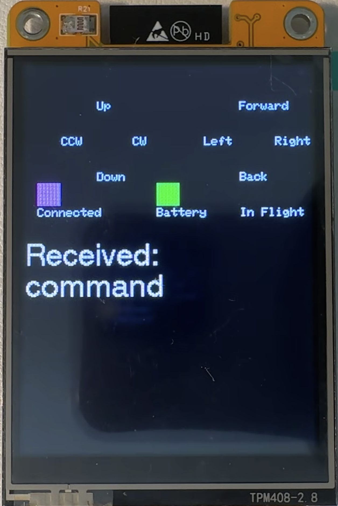

# Cheap Yellow Display Overview

This file provides guidance to users when working with code in this folder.

## Introduction

The StackChan software was inspired by the Drone Simulator software originally developed to run on the CYD: Cheap Yellow Display. The EEK was originally targeted at the Tello drone but the product has been discontinued. As part of the EEK educational experience, a Tello Drone simulator was created using the Arduino IDE and implemented using the Cheap Yellow Display (CYD) ESP32 device with a 320x240 TFT display.

The CYD includes both a display and an ESP32 processor. There are no real LEDs or programmable buttons as there are on the EEK. Virtual LEDs, small rectangular pixel areas, can be enabled to stand in for real LEDs. They are capable of showing a Pulse Width Modulation (PWM) effect where the brightnes of the pixel squares is tied to the strength of the GPIO signal pin whose value is sent from the EEK to the CYD Simulator.

The code in the TelloSimCYDPWM project folder implements a remote-control simulation capability using WiFi and UDP client/server principles. This code was used as the basis for the Drone Sumulator running on the StackChan as you can see by comparing to the two source files side by side.

The following picture shows the CYD Drone Simulator display.

