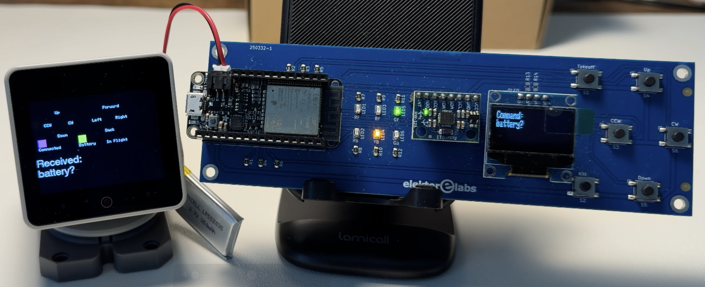
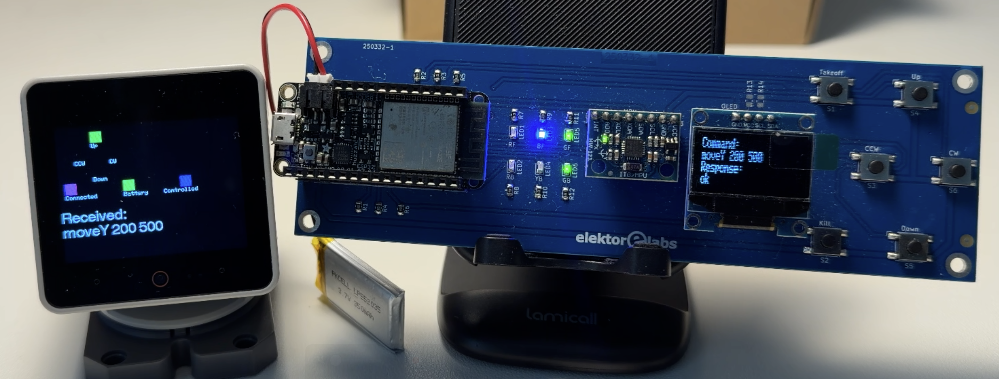

# EEK Controller Overview

This file provides guidance to users when working with code in this folder.

## Introduction

EEK hardware can control the StackChan when its firmware has been modified to act as a Tello Drone simulator. The EEK can also access selected hardware features of the StackChan including its display, servo motor control and the built in camera.

Two control Arduino programs are included for the EEK to interact with each firmware version when it is installed on the StackChan. These are both based on Drone Control code that was created to fly an actual Tello. The same Drone Control code can fly the simulator or a real Tello just be changing the remembered WiFi SSID of the Tello or Drone Simulator. This can be done through the Arduino Serial Monitor input text box for the EEK controller.

The following picture shows the EEK Drone Controller side-by-side with the StackChan programmed to serve as a drone simulator. The EEK includes an AdaFruit Feather version of the ESP32 development board that inludes a LiPo battery socket that allows the EEK to run on battery power.

The modified EEK StackChan controller uses its built-in buttons and gestures based on the included MPU6050 and its ability to compute tilt angles based on the accelerometer and gyroscope readings. Pre-programmed servo motion scripts can be attached to EEK button presses. The image below shows the EEK operating the StackChan via its Down button.

Two videos will show these controllers in action.