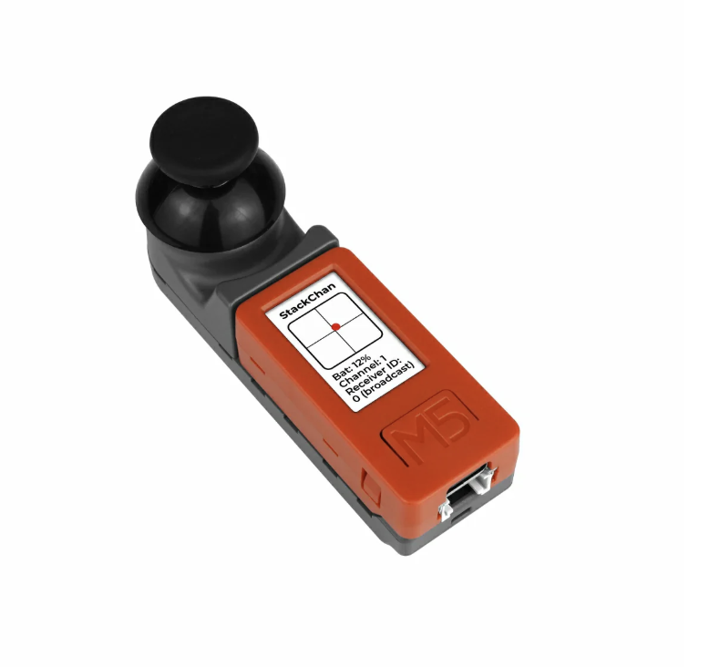

# EEK and M5Stack

This file provides guidance to users when working with code in this repository.

## Introduction

EEK (ESP32 by Example Kit) hardware can be used to control software running on the StackChan platform. In addition, the StackChan controller firmware can be modified to fly the Tello Drone simulator running on the StackChan and can control a real Tello Drone as well.

The EEK is available from Elektor: [EEK](https://academypro.elektor.com/courses/ESP32byExample)

The StackChan is available from M5Stack: [StackChan](https://shop.m5stack.com/products/stackchan-kawaii-co-created-open-source-ai-desktop-robot)

The stock firmware for the StackChan provides access to Chatbot behaviors that the EEK is not able to interface with and use. There are servo motor motions that the EEK can control as well as take and show pictures with the StackChan camera.

One version of the StackChan includes another device based on the M5StickCPlus hardware with a mini Joystick Hat pictured below.

Code in this repository includes three folders: one for the EEK Hardware as a controller, one for the StackChan controller and one for the StackChan itself. Each of these controllers has two Arduino projects that allows each controller to control the StackChan. The StackChan device folder itself has two projects that allow it to either function as a Drone Simulator or as a limited feature version of the StackChan where its servo motors and camera can be operated wirelessly by each controller.