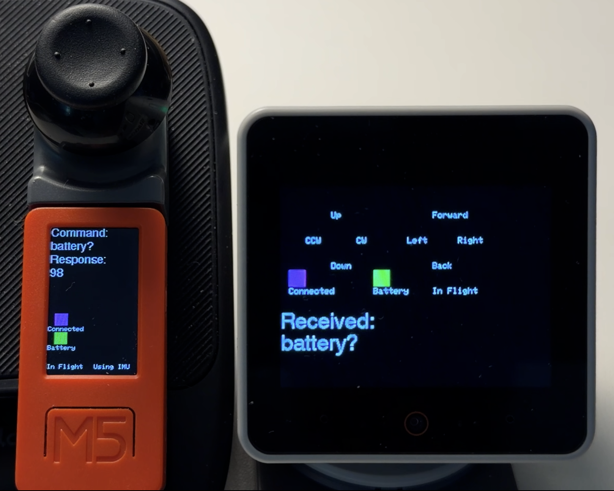
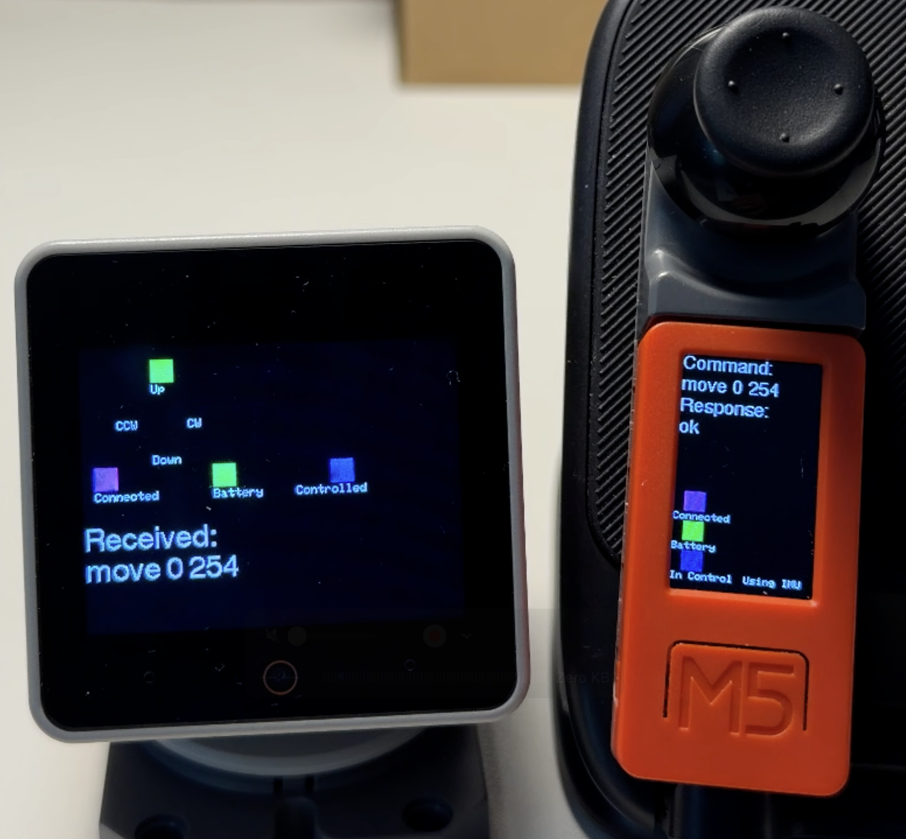

# StackChan Controller Overview

This file provides guidance to users when working with code in this repository.

## Introduction

The StackChan M5Stick controller firmware that is pre-installed on the controller can be replaced with Arduino-based software where its IMU and Joystick can control StackChan hardware features wirelessly. A similar approach allows the StackChan Controller to interact with the Tello Simulator running on the StackChan as well as control a real Tello.

Two control Arduino programs are included for the StackChan controller to interact with each firmware version that is installed on the StackChan. These are both based on Drone Control code that was created to fly an actual Tello.

The drone controller code included here can fly the simulator or a real Tello with no code changes required. The Serial Monitor input box allows the SSID for the StackChan to be entered as an argument to the ```connect``` command. This SSID is then remembered across restarts of the controller.

The image below shows the StackChan operating as a Drone Simulator and the screen of the StackChan controller after having connected to the simulator. The last command sent and received is shown on the screens and virtual LEDs show some status information like connectivity and battery strength.




StackChan controller code can also control the StackChan servos and camera features using the three buttons on the M5StickCPlus as well as Joystick and IMU actions. Some control action scripts are bound to the buttons and also to the built-in button on the Joystick itself. The picture below shows the StackChan after it has received a command through the JoyStick.



Two videos will show these controller versions in action.